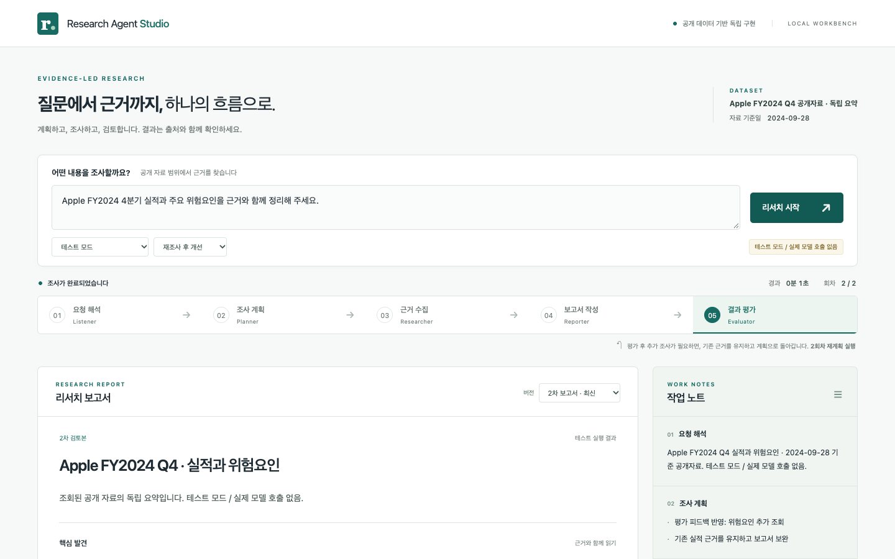

# Research Agent Studio

리서치 워크플로우를 구성하고 실제 실행 이벤트를 클라이언트에서 관측하는 로컬 프로토타입입니다. 질문 → 계획 → 읽기 전용 MCP 자료 조회 → 인용 보고서 → 평가 → 필요한 경우 재계획 과정을 실행하고, 단계·도구 호출·근거·보고서 revision을 한 화면에서 확인합니다. 공개 데이터 기반 독립 구현으로 특정 기업과 제휴하지 않으며 투자 자문 또는 최신 정보 서비스가 아닙니다.



## 빠른 시작

요구 환경: Python 3.12, Node.js 22, npm, uv. 최초 설치에는 패키지 레지스트리 네트워크 접근이 필요합니다. Docker·외부 데이터베이스·별도 MCP 설치는 필요 없습니다.

먼저 저장소를 clone하고 해당 디렉터리로 이동합니다.

```text
git clone https://github.com/EthanKlocked/research-agent-studio.git
cd research-agent-studio
```

### Windows · PowerShell

```powershell
.\scripts\setup.ps1
.\scripts\start.ps1 -TestMode
```

PowerShell 스크립트는 로컬 개발 환경에서 정적 계약 테스트를 했습니다. 별도 **Windows PowerShell 5.1 / Python 3.12.14 환경의 실행 결과가 보고**되었지만, 당시 커밋·로컬 수정 여부가 확인되지 않아 **현재 커밋의 Windows 검증 완료를 의미하지는 않습니다**. 발견된 인코딩·테스트 호환성 문제와 확인 범위는 [검증 문서](docs/verification.md)를 참고하세요. 실행 정책 때문에 스크립트가 차단되면 시스템 정책을 바꾸지 말고 아래 명령을 직접 실행할 수 있습니다.

```powershell
uv sync --locked --extra dev
npm.cmd --prefix frontend ci
npm.cmd --prefix frontend run build
$previousTestMode = [Environment]::GetEnvironmentVariable('RESEARCH_TEST_MODE', 'Process')
try {
    $env:RESEARCH_TEST_MODE = "1"
    uv run --locked --extra dev python -m uvicorn backend.api:app --host 127.0.0.1 --port 8765
} finally {
    [Environment]::SetEnvironmentVariable('RESEARCH_TEST_MODE', $previousTestMode, 'Process')
}
```

### macOS / Linux · Bash

```bash
bash scripts/setup.sh
bash scripts/start.sh --test
```

실제 설치·실행·브라우저 검증은 macOS에서 수행했습니다.

브라우저: **http://127.0.0.1:8765**. 종료: 실행한 터미널에서 **Ctrl+C**. 하나의 API 서버가 빌드된 프론트를 제공합니다. 하나의 Uvicorn worker만 사용하세요.

테스트 질문:

> Apple FY2024 4분기 실적과 주요 위험요인을 근거와 함께 정리해 주세요.

`재조사 후 개선` 시나리오를 선택하고 리서치를 시작합니다. 실제 LangGraph와 LangChain Agent, 실제 MCP stdio 자식 프로세스, 실제 API/SSE를 실행합니다. **모델 응답만 결정적 fixture이며 실제 모델 호출은 없습니다.** 이는 임의 질문에 대한 지능 검증이 아니라 고정 Apple 사례의 제어 흐름 시연입니다. 타이머로 단계를 흉내 내지 않습니다. 테스트 실행은 빠르게 끝날 수 있으며 개발 상세에서 실제 노드·도구·분기 이벤트를 확인할 수 있습니다.

## 모델 연결

`.env.example`의 모델 설정 값은 모두 비어 있습니다. 로컬 `.env` 또는 프로세스 환경변수로만 아래 이름에 값을 넣습니다. 프로세스 환경변수가 `.env`보다 우선합니다.

- `LLM_PROVIDER`: 구현된 adapter는 `openai` 또는 `openai-compatible`.
- `LLM_MODEL`: 사용하는 모델 식별자.
- `LLM_BASE_URL`: 해당 provider의 chat-completions API base URL. 원격은 HTTPS, HTTP는 loopback만 허용합니다.
- `LLM_API_KEY`: 로컬에서만 주입하는 키.
- `LLM_MAX_OUTPUT_TOKENS`: 선택 설정. 비워 두면 8192, 허용 범위 1–65536. 모델이 허용하는 한도 내에서 지정하세요. thinking을 포함하는 provider에서는 답변에 쓸 수 있는 토큰이 줄어들 수 있으며, 한도 증가는 비용·지연을 늘릴 수 있습니다.
- `RESEARCH_TEST_MODE`: 안전 기본값 `0`. `--test` 또는 PowerShell `-TestMode` 시작 옵션은 이 값을 `1`로 설정하여 별도 테스트 모드를 허용합니다.

모델·endpoint·키의 실제 예시 값은 제공하지 않습니다. `.env`를 Git에 넣지 마세요. 키를 브라우저 변수·localStorage에 넣지 마세요. 인증 없는 로컬 호환 서버도 클라이언트 프로토콜상 네 필드가 필요하므로 운영자가 비밀이 아닌 placeholder key를 정할 수 있습니다.

Windows PowerShell:

```powershell
Copy-Item .env.example .env
# 로컬 편집기로 .env를 설정한 다음:
.\scripts\start.ps1
```

macOS / Linux:

```bash
cp .env.example .env
# 로컬 편집기로 .env를 설정한 다음:
bash scripts/start.sh
```

이전에 직접 설정한 `RESEARCH_TEST_MODE=1`이 현재 터미널에 남아 있다면 제거하세요.

설정 미완료/형식 오류이면 실제 모델 실행을 막습니다. `configured`는 **설정 형식 충족**이지 인증 성공을 뜻하지 않습니다. `--test`와 실제 모델 설정을 함께 쓸 때는 화면에서 실행 모드를 명시적으로 선택합니다. 실제 모델 오류가 나도 테스트 모델로 대체하지 않습니다. LangSmith tracing과 모델 HTTP 환경 proxy 사용은 비활성화합니다.

### Gemini 호환 범위

사용자 제공 API 테스트 보고 기준으로 **Gemini는 2.5 계열까지 확인됨**입니다. 정확한 모델별 전체 성공이나 보고서 품질을 보증하지 않으며, 이번 수정본의 실제 연결은 재검증이 필요합니다. 초기 Windows 테스트 모드 브라우저 흐름은 로컬 수정본에서 확인되었습니다. 초기 실제 모델 확인은 API-only였으며, 이후 `5a3c325`에서 실제 모델 브라우저 실행 1회가 timeout으로 끝났고 오류 분류 표시는 정상이었다는 사용자 보고가 있습니다.

**Gemini 3.x는 현재 미지원**입니다. 현재 OpenAI-compatible 어댑터는 도구 호출의 `thought_signature` 왕복 전달을 지원하지 않아 후속 요청에서 400 오류가 날 수 있습니다. Gemini 전용 어댑터는 포함하지 않습니다.

### 사용자 설정 후 live smoke

1. 테스트 옵션 없이 시작하고 화면에서 실제 모델 모드를 확인합니다.
2. 위 질문을 실행합니다. 또는 별도 터미널에서:

```bash
curl --fail-with-body -sS http://127.0.0.1:8765/api/runs \
  -H 'Content-Type: application/json' \
  -d '{"question":"Apple FY2024 4분기 실적과 주요 위험요인을 근거와 함께 정리해 주세요.","mode":"live","scenario":"pass"}'
```

3. 반환된 `run_id`로 snapshot `/api/runs/<run_id>`와 SSE `/api/runs/<run_id>/events`를 확인합니다. UI는 이 API를 사용합니다.
4. MCP 조회 근거와 인용을 열어 분기·연간 수치, GAAP/비GAAP, 위험의 불확실성 표현을 검토합니다. 첫 평가에서 통과해도 정상이며 재조사를 보장하지 않습니다. 실제 `revise`가 나오면 Planner 재진입과 기존 근거 보존을 확인합니다.
5. 실패 경로를 확인하려면 **운영자가 로컬 설정에 잘못된 테스트용 인증값을 직접 사용**하고 오류 종료 및 비밀값 미노출을 확인한 뒤 정상 설정으로 되돌립니다. 실서비스 키를 폐기하거나 변경할 필요는 없습니다. 재조사·한도·도구 오류를 결정적으로 확인하려면 별도 테스트 모드를 이용합니다.

**실제 provider 인증, 선택한 모델의 tool calling/JSON 호환성, 보고서 품질·의미상 사실성, provider 측 취소 효과는 사용자 설정 후 확인 필요합니다. 이 저장소의 키 없는 테스트는 이를 검증하지 않습니다.**

## 클라이언트

- 질문·실행·중단, 역사적 데이터 기준일, 실행 단계·시간·회차.
- 구조화된 계획, 실제 도구 조회, 평가 이슈·후속 조사.
- 보고서 버전 선택, 이전 보고서 비교, 추가된 근거와 출처/구간 확인.
- 접이식 실행 이벤트와 State 변경 필드. 내부 추론·시스템 프롬프트를 노출하는 debugger가 아닙니다.
- SSE 순서/실행 격리, 연결 오류 표시와 snapshot 우선 재동기화. 새로고침 시 sessionStorage의 run ID만 사용해 현재 snapshot을 복원합니다. 기존 상세 이벤트 전체를 복구한다고 주장하지 않습니다.

## 구조와 상태 매핑

```text
frontend/       React + TypeScript / Vite
backend/        FastAPI, 환경 설정, Agent factory, LangGraph, run manager
mcp_server/     검색·구간 조회 전용 stdio 서버
data/           공개 출처에 기반한 짧은 독립 요약과 provenance
tests/          키 없는 단위·통합·실제 MCP 프로토콜 테스트
scripts/        설치·시작·테스트
docs/           설계·QA·화면 캡처
```

상위 State는 question, interpreted_request, plan, evidence, report, revisions, evaluation, feedback, iteration, status, errors를 전달합니다. 각 역할의 내부 메시지는 역할별로 새로 구성하고 검증한 JSON만 상위 State에 반영합니다. Researcher만 허용 도구를 받습니다. 근거는 실제 구간 조회 결과에서만 추가하고 ID로 중복을 제거합니다. 재계획은 근거·평가 피드백을 보존합니다. Checkpointer/DB는 사용하지 않으며 **서버 재시작 시 모든 실행 기록이 사라집니다**.

### 재조사 실패 시 이전 보고서

2회차가 실패하면 마지막 평가까지 완료된 보고서와 그 근거를 복원하고 `partial_result`에 보존 회차를 기록합니다. 상태는 `error`이며 **평가 통과가 아닙니다**. 화면에 “이전 보고서 · 추가 조사 실패 · 평가 미통과”와 원래 오류를 함께 표시합니다. 명시적 취소는 취소 상태를 유지합니다.

Evaluator/Reporter에는 활성 데이터셋의 문서 범위 밖 요구를 재조사 사유가 아니라 보고서 한계로 명시하도록 지시합니다. 범위 내 누락과 근거 없는 주장은 여전히 수정 대상입니다. 이는 모델에 대한 지시이며 실제 모델의 준수·의미상 정확성은 별도 검증이 필요합니다.

## 데이터·안전 경계

Apple FY2024 공개자료를 대상으로 **2024-09-28 기준**, 2024-10-31/11-01 게시 자료의 짧은 독립 요약을 사용합니다. 원문 전체를 재배포하지 않습니다. 번들 자료의 `excerpt`는 원문 직접 인용이 아닌 작성된 사실 요약이며 구간 ID도 요약 데이터셋의 ID입니다. 선택적 공식 자료의 excerpt는 원문에서 추출한 짧은 문단 또는 재무 표의 사실 행이며, 별도 source_kind와 source_locator로 구분합니다. [출처·획득일·재배포 범위](data/README.md)를 확인하세요.

MCP 도구는 `search_documents`, `get_section`뿐입니다. 고정 데이터셋/ID allowlist, 검색 입력·결과·호출수 제한을 적용합니다. 임의 shell/SQL/경로/URL fetch가 없습니다. 문서 지시는 신뢰하지 않으며 프롬프트 경고만으로 injection 방어가 완성되었다고 주장하지 않습니다. 인용 ID 존재 검사는 사실성 보장이 아닙니다.

기본 한도:
- 총 **2회차**: 최초 실행 1회 + 최대 추가 재계획 1회.
- 동시 실행 2개, 메모리 실행 20개, 실행별 최근 이벤트 160개.
- 질문 2,000자, 요청 본문 16,000바이트, 본문 수신 5초.
- 전체 실행 기본 600초(`RUN_TIMEOUT`), 개별 모델 HTTP 요청 기본 30초(`LLM_REQUEST_TIMEOUT`), MCP 작업 10초.
- 역할 전체 제한: `RESEARCHER_TIMEOUT` 180초, `LISTENER_TIMEOUT`·`PLANNER_TIMEOUT`·`REPORTER_TIMEOUT`·`EVALUATOR_TIMEOUT` 각각 60초. 도구 반복과 보정 재요청도 역할 제한 안에 포함됩니다.
- timeout 환경변수는 초 단위이며 빈 값은 기본값, 유한한 양수부터 최대 7200초까지 허용합니다. 한도를 늘리면 대기 시간과 모델 사용 비용이 늘어날 수 있습니다.
- Researcher 회차별 도구 12회(잘못된 입력도 포함), 입력 수정 기회 최대 2회, 검색 최대 5건.
- 도구 호출/수정 예산과 MCP timeout은 서버 `Settings`에서 관리합니다. 브라우저에서 한도를 변경할 수 없습니다.

모델 출력은 단일 JSON 객체 또는 응답 전체를 감싼 하나의 JSON/무표기 코드펜스만 허용합니다. 앞뒤 설명에서 임의로 JSON을 추출하거나 잘못된 필드를 자동 보정하지 않습니다. Provider별 구조화 출력 지원을 가정해 `response_format`을 일괄 강제하지 않습니다. JSON·역할 스키마 오류는 필드 경로와 오류 유형만 안전하게 전달해 최대 1회 재요청합니다. 같은 역할의 timeout과 도구 예산을 공유하며, 재검증 실패나 인용 오류는 종료합니다. 출력 잘림(`finish_reason=length`)은 재요청하지 않고 출력 한도 초과로 종료합니다. 자동으로 성공 처리하거나 필드를 잘라내지 않습니다.

잘못된 도구 인자·문서/구간 ID는 제한 내에서 안전한 오류 정보를 모델에 돌려주어 수정할 수 있게 합니다. 오류 이후 실제 구간 조회에 성공해야 복구된 것으로 인정하며, 검색만 성공하거나 잘못된 호출을 그대로 남긴 채 답하면 오류로 종료합니다. 금지된 도구, 예산 소진, MCP 통신 장애, timeout·취소는 복구 대상으로 취급하지 않습니다. UI는 도구 입력 오류를 정상적인 빈 조회와 구분합니다. 검색 결과는 본문 요약 없이 메타데이터만 반환합니다. 검색 결과가 있지만 조회된 구간이나 기존 근거가 없는 경우 `retrieval_incomplete` 오류이며, 정상적인 빈 검색과 구분합니다. 모든 역할은 데이터셋 이름·기준일·문서/구간 범위·게시일을 입력받습니다.

오류는 기존 `status=error`를 유지하며 `[역할/분류]`와 고정된 안내를 표시합니다. 분류는 `output_limit`, `validation`, `retrieval_incomplete`, `timeout`, `tool`, `provider_or_execution`입니다. 혼합 예외에서는 timeout을 도구 오류보다 우선 분류합니다. 서버 로그는 역할·분류와 길이 제한된 허용 예외 클래스 체인만 기록하며 원본 provider 응답·예외 내용·키를 기록하지 않습니다. 자료 없음과 조회 실패를 구분합니다. 취소는 실제 asyncio 실행 중단과 MCP/HTTP 자원 정리를 시도합니다. 연결된 provider가 서버 측 계산을 즉시 멈춘다는 보장은 없습니다. SSE 연결만 끊는 것은 취소가 아닙니다.

Loopback 전용, 동일 출처 요청 검사·host 제한을 적용합니다. 계정 인증, 다중 사용자 권한, 영속 복구, 인터넷 공개 운영은 범위 밖입니다. 외부에 포트를 공개하지 마세요.

## 선택: Apple 공식 공개자료 추가 조회

기본은 번들 자료만 사용하는 오프라인 조회입니다. 로컬 `.env`에 `RESEARCH_PUBLIC_SOURCES=1`을 설정하고 서버를 재시작하면 실제 모델 모드에서 고정된 Apple FY2024 Q4 공식 재무 PDF와 실적 발표 페이지를 추가 조회할 수 있습니다. 테스트 모드는 이 옵션이 켜져 있어도 외부 조회를 비활성화합니다. API 키나 유료 검색 서비스는 필요하지 않습니다. 범용 웹 검색·최신 기업정보 조회가 아닙니다.

PDF 파싱은 **Poppler `pdftotext`**가 추가로 필요합니다. 운영자가 설치한 실행 파일을 PATH에 두거나 `RESEARCH_PDFTOTEXT`에 실행 파일 경로를 지정하세요(Windows는 `pdftotext.exe`). 빈 값은 PATH 탐색을 사용합니다. 이 프로젝트는 Poppler를 자동 설치하지 않으며 Windows의 해당 실행 경로는 아직 직접 검증하지 않았습니다. `pdftotext -v`로 설치 여부를 확인할 수 있습니다.

허용된 두 URL만 접근하며 redirect/proxy는 사용하지 않습니다. MCP 세션별 최대 두 번의 HTTP 시도, 응답 6 MiB, 다운로드 6초, PDF 파싱 2초와 성공/실패 캐시를 적용합니다. 전체 원문은 저장하지 않고 필요한 사실 구간과 출처 URL·게시일·조회 시각·바이트 수·SHA-256을 보존합니다. 캐시는 연구 노드의 MCP 세션 동안만 유지됩니다. 재무 표의 gross margin은 **USD millions 금액이며 비율이 아닙니다**.

실제 공개자료 접근만 확인하는 명령(모델 호출 없음):

```powershell
$env:RESEARCH_PUBLIC_SOURCES = "1"
uv run --locked --extra dev python -m mcp_server.smoke_public_sources
```

[실제 조회 기록과 출처](data/public_source_smoke.md)를 참고하세요. 공개 페이지의 향후 접근 가능성·형식은 보장하지 않습니다. 선택적 공개자료의 일반 조회 실패는 `unavailable`로 구분하고, 다른 실제 근거가 있으면 보고서 한계에 명시합니다. 조회 불가 결과는 인용 근거가 아니며 실제 근거가 전혀 없으면 오류로 종료합니다. 보안 경계 위반·도구 예산 초과·MCP 통신 실패는 계속 치명적 오류입니다.

## 검증

```bash
bash scripts/test.sh
# 개별 실행:
uv run --locked --extra dev python -m pytest tests -q
npm --prefix frontend test
npm --prefix frontend run typecheck
npm --prefix frontend run build
```

Windows에서는 `.\scripts\test.ps1`을 사용할 수 있습니다. 검증 범위와 남은 항목은 [검증 문서](docs/verification.md), 상태·이벤트 구조는 [아키텍처](docs/architecture.md)를 확인하세요. Python 의존성은 `uv.lock`, frontend는 `frontend/package-lock.json`으로 고정합니다.

소스 공개와 별개로 호스팅된 서비스는 제공하지 않습니다. 모든 실행은 사용자의 로컬 환경에서 이루어집니다.
